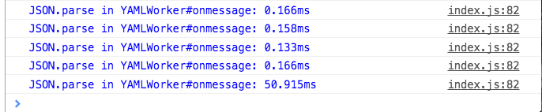

Non-blocking Asynchronous JSON.parse Using The Fetch API

The problem

I am working on Swagger Editor performance. One of the solutions to speed things up was moving process-intensive task to Web Workers. Web Workers do a great job of moving process-heavy tasks out of the main thread but the way we can communicate with them is very slow. For each message to be sent to or received from a worker we need to convert it to a string. This means for transferring objects between the main thread and worker threads we need to JSON.parse and JSON.stringify our objects back and forth.

For larger objects, this can lead to large blocking JSON.parse calls. For example, when transferring back the AST from our AST-composer worker I saw a 50ms pause. A 50 millisecond pause can easily drop 4 frames.

The solution

It’s 2015 but JavaScript or the web does not have a non-blocking JSON API! So there is no native or out of the box solution to this. Because communicating with a working is via string, doing JSON.parse in a worker is also pointless.

When I was exploring the Fetch API (window.fetch) I noticed the Response object has an asynchronous .json method. This is how it’s used:

fetch('/foo.json')
  .then(function(response) {
    response.json().then(function(result) {
      // result is parsed body of foo.json
    });
  });
We can use (abuse?) this API to move all of our JSON-parsing business out of the main thread. It can be done as simple as:

function asyncParse(string) {
  return (new Response(string)).json();
}
It works as expected:

asyncParse('{"foo": 1}').then(function (result) {
  // result is {foo: 1}
});
Performance

Moving JSON.parse out of the main thread make the actual parsing time less important but let’s see how it’s different than native JSON.parse:

// jsonStr is 65,183 charctars

console.time('sync: total time (blocking)');
JSON.parse(jsonStr);
console.timeEnd('sync: total time (blocking)');

console.time('async: blocking time');
console.time('async: total time');
asyncParse(jsonStr).then(function(result) {
    console.timeEnd('async: total time');
});
console.timeEnd('async: blocking time');
Result:

sync: total time (blocking): 1.149ms
async: blocking time: 0.745ms
async: total time: 3.232ms
The async method is about 2x slower but hey, it’s async and using it blocked the UI for less than a millisecond!

Conclusion

I’ll experiment with this and if it made sense I’ll make a package and publish it. I hope JavaScript or DOM provides native non-blocking JSON APIs so we don’t have to do hacks like this. With async/await in ES7(ES2016) working with async methods are much easier so we should have async JSON APIs as well.